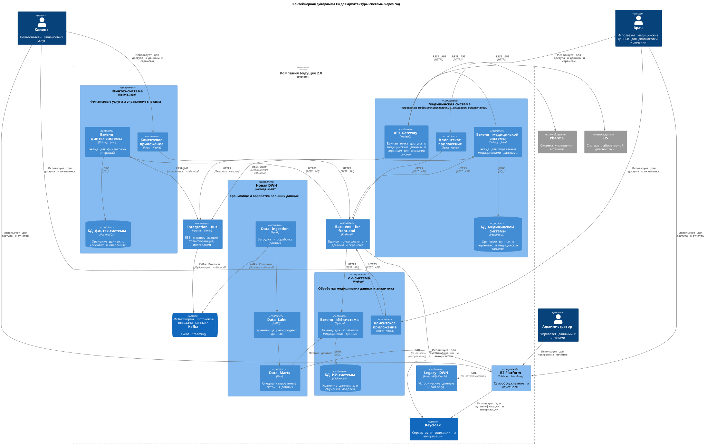

# Задание 1. Видение будущей архитектуры, анализ проблем и их приоритезация

## C4 Container Diagram будущей архитектуры
Будущая архитектуры систем компании должна состоять из следующих компонент через 1 год (предположительно):
 - Integration Bus
   - Модернизация шины данных для обеспечения гибкой интеграции между компонентами системы.
 - API Gateway
   - Обеспечение единой точки доступа к данным и сервисам для различных потребителей.
 - BI Platform
   - Внедрение современной BI-платформы (например, Tableau, Metabase) с возможностью самообслуживания и конструктором отчетов.
 - Data Marts
   - Создание специализированных витрин данных для различных бизнес-направлений (финтех, ИИ-сервисы, управление клиниками и медицинскими данными).
 - Data Lake
   - Создание озера данных для хранения разнородной информации, включая медицинские данные, финансовые данные и другие.
 - DWH
   - Миграция на современную СУБД (например, Hadoop, Spark) с оптимизацией структуры данных и бизнес-логики.
 - AI Platform**
   - Развитие платформы для работы с искусственным интеллектом, включая сервисы обработки медицинских данных и другие.

### Диаграмма будущей архитектуры

### Описание будущей архитектуры
Компания "Будущее 2.0" планирует модернизацию своей IT-инфраструктуры, отказ от устаревших решений и внедрение новых технологий для улучшения управления данными. Ключевые изменения:

 - Разделение на отдельные домены
   - DWH больше не является центральной точкой всех бизнес-процессов. Введены специализированные сервисы для работы с медицинскими, финансовыми и аналитическими данными.
 - Новая шина данных
   - Вместо устаревшей Apache Camel используется Kafka или аналогичная технология для потоковой передачи данных.
 - Витрина данных (Self-Service BI)
   - Выделена новая платформа для построения отчётов, работающая с агрегированными данными.
 - Модернизация DWH
   - Перенос на современную СУБД, уменьшение бизнес-логики внутри хранилища.
 - Интеграция новых бизнесов
   - Поддержка взаимодействия с аптеками и провайдерами лабораторной диагностикичерез API.

## Проблемные места и их приоритизация
|Проблема|Описание|Приоритет|
|-|-|-|
|Устаревший DWH|SQL Server 2008 не масштабируется, сложен в обслуживании|must have|
|Медленные отчёты|Встроенная бизнес-логика замедляет построение аналитики|must have|
|Отсутствие модульности|Новые бизнесы требуют изменений в центральной системе|must have|
|Устаревшая шина данных|Apache Camel не поддерживает современные требования к интеграции|nice to have|
|Нет удобного BI-решения|Требуется гибкий инструмент самообслуживания|nice to have|
|Неэффективное хранение данных|Всё хранится в одном DWH, нагрузка растёт|nice to have|