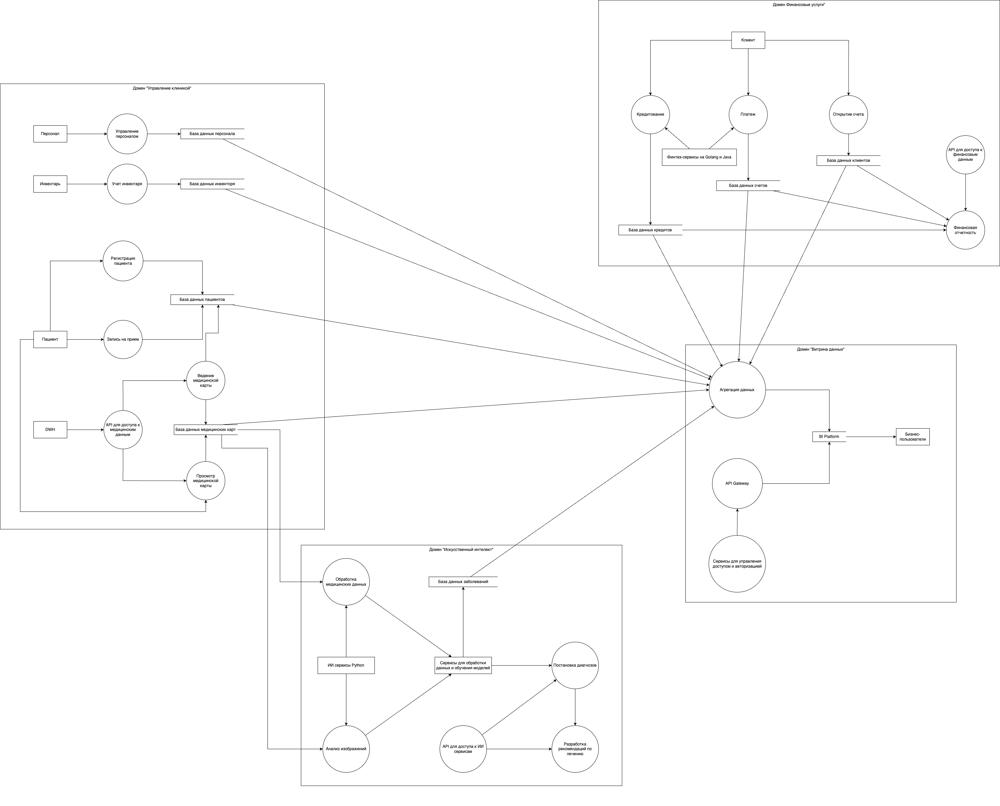

# Задание 2. Разделение системы на домены

## Домены
Для обеспечения независимого развития бизнес-направлений предлагается разделить систему на следующие домены:

 - Домен "Управление клиникой":
   - Функции: Ведение медицинских карт, учет пациентов, управление персоналом, учет инвентаря.
   - Данные: Медицинские карты, истории болезни, данные о пациентах, данные о персонале, данные об инвентаре.
   - Сервисы: DWH (мигрированный и оптимизированный), API для доступа к медицинским данным, сервисы для управления персоналом и инвентарем.
 - Домен "Финансовые услуги":
    - Функции: Ведение счетов, обработка платежей,кредитование, финансовая отчетность.
    - Данные: Данные о клиентах, данные о счетах, данные о кредитах, финансовая отчетность.
    - Сервисы: Финтех-сервисы (Golang и Java), API для доступа к финансовым данным, сервисы для обработки платежей и кредитования.
 - Домен "Искусственный интеллект":
    - Функции: Обработка медицинских данных, анализ изображений, постановка диагнозов, разработка рекомендаций по лечению.
    - Данные: Медицинские данные (изображения, результаты анализов), данные о пациентах, данные о заболеваниях.
    - Сервисы: ИИ-сервисы (Python), API для доступа к ИИ-сервисам, сервисы для обработки данных и обучения моделей.
 - Домен "Витрина данных":
    - Функции: Предоставление доступа к аналитическим данным для бизнес-пользователей, создание отчетов, визуализация данных.
    - Данные: Агрегированные данные из других доменов.
    Сервисы: BI Platform, API Gateway, сервисы для управления доступом и авторизацией.

## Data Flow Diagram

## Преимущества разделения на домены:

 - Независимое развитие
   - Каждый домен может развиваться независимо от других, что ускоряет time-to-market для новых функций и сервисов.
 - Масштабируемость
   - Каждый домен может масштабироваться независимо от других, что обеспечивает гибкость и эффективность использования ресурсов.
 - Улучшение производительности
   - Разделение данных и сервисов по доменам позволяет оптимизировать производительность каждого домена в отдельности.
 - Безопасность
   - Разделение данных по доменам повышает безопасность и конфиденциальность информации.
 - Упрощение интеграции
   - Integration bus обеспечивает единую точку доступа к данным и сервисам для всех потребителей, что упрощает интеграцию между доменами.