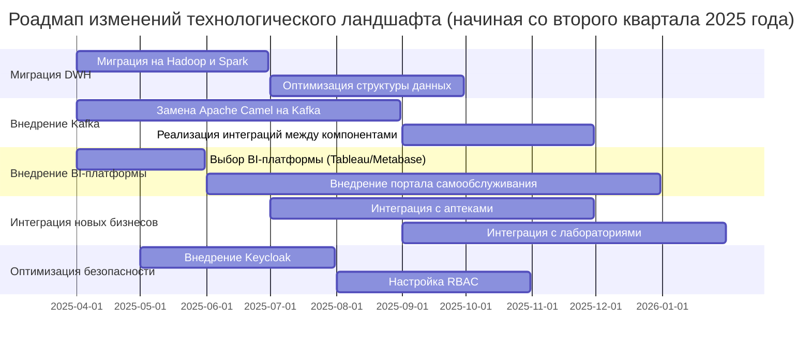

# Задание 3: Технический радар, роадмап и обоснование изменений

## 1. Технический радар

Технический радар отражает текущие и предлагаемые технологии, а также их статус в компании. Радар разделён на четыре квадранта:

- Adopt (Принять)
  - Технологии, которые уже используются или должны быть внедрены в ближайшее время.
- Trial (Пробовать)
  - Технологии, которые находятся на стадии тестирования или пилотного внедрения.
- Assess (Оценить) 
  - Технологии, которые рассматриваются для внедрения, но требуют дополнительной оценки.
- Hold (Отложить)
  - Технологии, которые не рекомендуются для использования в текущий момент.

|Категория|Технология/Методология|Статус|Описание|
|-|-|-|-|
|Adopt|Kafka|Принять|Замена Apache Camel для потоковой обработки данных|
|Adopt|Hadoop, Spark|Принять|Для обработки больших данных и замены устаревшего DWH|
|Adopt|Tableau, Metabase|Принять|Для создания портала самообслуживания BI|
|Adopt|PostgreSQL|Принять|Для хранения данных в финтех- и медицинских системах|
|Trial|ClickHouse|Пробовать|Для аналитики и хранения данных в ИИ-системе|
|Trial|Keycloak|Пробовать|Для аутентификации и авторизации|
|Assess|Kubernetes|Оценить| Для оркестрации контейнеров и масштабирования сервисов|
|Assess|GraphQL|Оценить|Для улучшения API Gateway и гибкости запросов|
|Hold|Apache Camel|Отложить|Устаревшая технология, заменена на Kafka|
|Hold|SQL Server 2008|Отложить|Устаревшая СУБД, заменена на PostgreSQL и Hadoop|

## 2. Роадмап (начиная со второго квартала 2025 года)
Роадмап описывает этапы изменений в технологическом ландшафте компании, начиная со второго квартала 2025 года. Каждый этап включает цели, результаты, ответственные команды и ресурсы.

## 3. Обоснование изменений

1. Миграция DWH на Hadoop и Spark
   - Цель
     - Улучшение производительности и масштабируемости хранилища данных.
   - Обоснование
     - Устаревший SQL Server 2008 не справляется с текущими нагрузками. Hadoop и Spark позволяют эффективно обрабатывать большие объёмы данных.

2. Замена Apache Camel на Kafka
   - Цель
     - Улучшение интеграции между системами и поддержка потоковой обработки данных.
   - Обоснование
     - Apache Camel устарел и не поддерживает современные требования к интеграции. Kafka обеспечивает гибкость и высокую производительность.

3. Внедрение BI-платформы (Tableau/Metabase)
   - Цель
     - Создание портала самообслуживания для бизнес-пользователей.
   - Обоснование
     - Текущая BI-система не удовлетворяет потребностям бизнеса. Tableau и Metabase предоставляют гибкие инструменты для аналитики и отчётности.

4. Интеграция с аптеками и лабораториями
   - Цель
     - Расширение функциональности системы за счёт интеграции с внешними партнёрами.
   - Обоснование
     - Это позволит компании предоставлять более полный спектр услуг и улучшить взаимодействие с партнёрами.

5. Внедрение Keycloak
   - Цель
     - Улучшение безопасности и управления доступом.
   - Обоснование
     - Keycloak предоставляет современные механизмы аутентификации и авторизации, что повышает безопасность системы.

6. Оценка Kubernetes и GraphQL
   - Цель
     - Улучшение масштабируемости и гибкости системы.
   - Обоснование
     - Kubernetes может упростить управление контейнерами, а GraphQL — улучшить гибкость API Gateway.